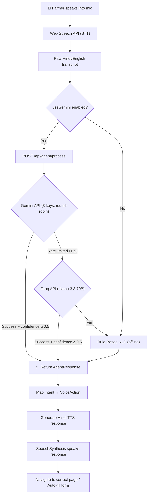
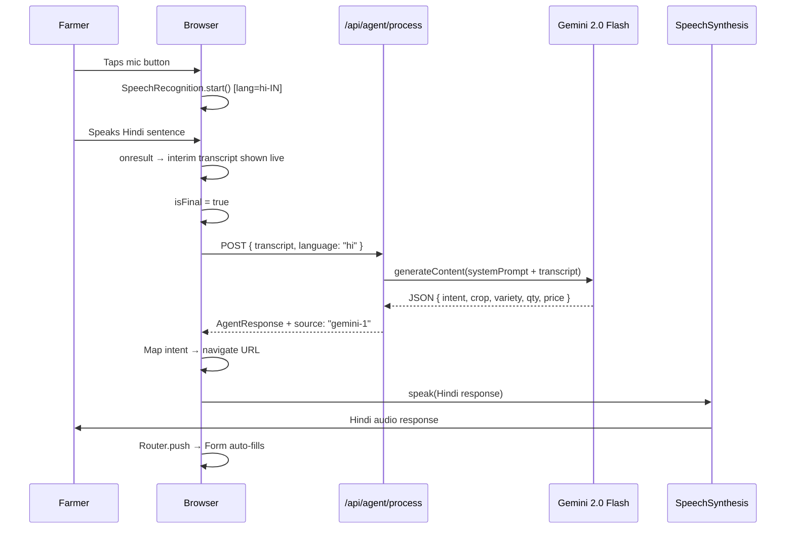

# 🧠 AgriConnect AI System — Complete Technical Deep Dive

This document explains **every AI component, algorithm, data flow, and file** powering the AgriConnect platform.

---

## 📐 Architecture Overview



---

## 🔗 The 3-Tier AI Fallback Chain

The core design principle is **"never fail silently"**. The system chains 3 AI providers so the farmer always gets a response, even offline.

| Tier | Provider | Model | Cost | Latency | When Used |
|------|----------|-------|------|---------|-----------|
| 1 | Google Gemini | `gemini-2.0-flash` | Free tier | ~1-2s | Primary — 3 API keys rotated |
| 2 | Groq | `llama-3.3-70b-versatile` | Free tier | ~0.5s | If all Gemini keys exhausted |
| 3 | Local Rule-Based | Regex + dictionary | Zero | Instant | Always works, even offline |

**File:** `lib/services/agent/geminiRotation.ts`

### How the chain works:

```
processAgentRequest(transcript, language)
  │
  ├─ 1. Try Gemini keys in round-robin (tryGemini)
  │     ├─ Key 1 → success? return result
  │     ├─ Key 1 rate-limited (429)? try Key 2
  │     ├─ Key 2 → success? return result
  │     └─ Key 3 → success? return result
  │
  ├─ 2. All Gemini failed? → Try Groq (tryGroq)
  │     └─ Groq returns JSON? return result
  │
  └─ 3. All APIs failed? → Rule-Based fallback (tryRuleBased)
        └─ Always returns a result (zero API cost)
```

---

## 📁 Complete File Map

| File | Purpose |
|------|---------|
| `lib/constants/agentPrompt.ts` | System prompt for Gemini/Groq + TypeScript types |
| `lib/services/agent/geminiRotation.ts` | 3-tier fallback chain: Gemini → Groq → Rule-Based |
| `lib/services/agent/ruleBasedFallback.ts` | Offline NLP engine (335 lines of regex + dictionaries) |
| `lib/services/agent/intentActions.ts` | Maps intents → navigation URLs |
| `lib/services/agent/voiceResponses.ts` | Hindi TTS response templates |
| `app/api/agent/process/route.ts` | Server-side API endpoint |
| `hooks/useVoiceAgent.ts` | Client-side React hook (STT + API + TTS) |
| `components/farmer/MicFAB.tsx` | Floating mic button (available on ALL farmer pages) |
| `components/farmer/MicFAB.module.css` | Premium CSS with glassmorphism + animations |
| `components/farmer/VoiceListingPanel.tsx` | Inline voice panel on listing creation page |
| `components/farmer/VoiceTutorial.tsx` | First-time voice tutorial overlay |
| `app/farmer/layout.tsx` | Farmer layout — injects MicFAB + VoiceTutorial globally |

---

## 🎤 Layer 1: Speech-to-Text (STT)

**API Used:** Browser-native Web Speech API  
**File:** `hooks/useVoiceAgent.ts`

### Algorithm:
1. Create a `SpeechRecognition` instance with `lang = 'hi-IN'` (Hindi)
2. Enable `interimResults = true` for live transcription feedback
3. On each `onresult` event, accumulate interim + final transcripts
4. When a `isFinal` result arrives → pass to `processTranscript()`

### Key configuration:
```typescript
recognition.lang = 'hi-IN';       // Hindi recognition
recognition.interimResults = true; // Live feedback while speaking
recognition.maxAlternatives = 1;   // Best guess only
recognition.continuous = false;    // Single utterance mode
```

> **Note:** The Web Speech API runs entirely in the browser (Chrome uses Google's cloud speech servers internally). No API key is needed.

---

## 🤖 Layer 2A: Gemini AI (Primary NLP)

**Model:** `gemini-2.0-flash`  
**SDK:** `@google/generative-ai`  
**File:** `lib/services/agent/geminiRotation.ts` (lines 29-67)

### Algorithm — Prompt Engineering:

The entire intelligence lives in the **system prompt** (`lib/constants/agentPrompt.ts`). It instructs Gemini to:

1. **Crop Mapping** — Translate Hindi/Hinglish/Devanagari crop names to English (e.g., `gehun` → `Wheat`, `गेहूं` → `Wheat`)
2. **Number Parsing** — Convert Hindi number words (`pachas` → 50, `hazaar` → 1000)
3. **Unit Conversion** — Normalize all quantities to KG (`1 quintal = 100 kg`, `1 bori = 50 kg`)
4. **Price Normalization** — If price is "per quintal", divide by 100 to get per-kg price
5. **Variety Extraction** — "Sharbati gehun" → `crop_name=Wheat, variety=Sharbati`
6. **Category Auto-Assign** — Wheat → Grains, Onion → Vegetables, Cotton → Fibers
7. **Intent Classification** — Classify into one of **10 intents** (see table below)
8. **Return strict JSON** — No markdown, no explanation

### Crops Supported (Hindi → English):

| Hindi Input | English Output | Category |
|-------------|---------------|----------|
| gehun / गेहूं | Wheat | Grains |
| pyaz / प्याज | Onion | Vegetables |
| tamatar / टमाटर | Tomato | Vegetables |
| aalu / आलू | Potato | Vegetables |
| chawal / चावल / dhan / धान | Rice | Grains |
| makka / मक्का / bhutta | Maize | Grains |
| mirch / मिर्च | Green Chili | Spices |
| sarson / सरसों | Mustard | Oilseeds |
| jau / जौ | Barley | Grains |
| soyabean / सोयाबीन | Soybean | Pulses |
| kapas / कपास | Cotton | Fibers |
| ganna / गन्ना | Sugarcane | Cash Crops |
| haldi / हल्दी | Turmeric | Spices |

### Unit Conversions Applied:

| Spoken Unit | Conversion |
|-------------|-----------|
| 1 quintal (क्विंटल) | 100 kg |
| 1 bori (बोरी) | 50 kg |
| 1 katta (कट्टा) | 50 kg |
| 1 peti (पेटी) | 20 kg |

### Generation Config:
```typescript
generationConfig: {
  responseMimeType: 'application/json', // Force JSON output
  maxOutputTokens: 300,                  // Keep response small
  temperature: 0.1,                      // Near-deterministic
}
```

### Round-Robin Key Rotation:
```typescript
// 3 keys stored in env vars
const GEMINI_KEYS = [GEMINI_API_KEY_1, GEMINI_API_KEY_2, GEMINI_API_KEY_3];
let currentKeyIndex = 0;

// After successful call, advance to next key
currentKeyIndex = (keyIndex + 1) % GEMINI_KEYS.length;

// On 429/RESOURCE_EXHAUSTED, skip to next key automatically
```

### JSON Output Schema:
```json
{
  "intent": "CREATE_LISTING",
  "confidence": 0.95,
  "params": {
    "crop_name": "Wheat",
    "variety": "Sharbati",
    "category": "Grains",
    "quantity_kg": 200,
    "price_per_kg": 21,
    "unit_spoken": "quintal",
    "harvest_date": null,
    "organic": false,
    "price_b2b_50": null,
    "price_b2b_200": null
  },
  "response_hi": "200 किलो शरबती गेहूं, ₹21/किलो — listing बना रहा हूं।"
}
```

---

## 🦙 Layer 2B: Groq AI (Secondary NLP)

**Model:** `llama-3.3-70b-versatile` (Meta's Llama 3.3, 70B parameters)  
**SDK:** `groq-sdk`  
**File:** `lib/services/agent/geminiRotation.ts` (lines 70-96)

Uses the **exact same system prompt** as Gemini but via Groq's ultra-fast inference:

```typescript
const chat = await groq.chat.completions.create({
  model: 'llama-3.3-70b-versatile',
  messages: [
    { role: 'system', content: AGENT_SYSTEM_PROMPT },
    { role: 'user', content: transcript },
  ],
  response_format: { type: 'json_object' },
  max_tokens: 300,
  temperature: 0.1,
});
```

---

## 📏 Layer 3: Rule-Based NLP (Offline Fallback)

**File:** `lib/services/agent/ruleBasedFallback.ts` — **335 lines of pure algorithmic NLP**

This is a **zero-API, zero-cost NLP engine** that works entirely offline using regex pattern matching and dictionary lookups.

### 3A. Crop Name Resolution (Dictionary Lookup)

A **42-entry bilingual dictionary** mapping Hindi (romanized + Devanagari) to English:

```
gehun / gehu / गेहूं / गेहू → Wheat
pyaz / pyaaz / प्याज → Onion
tamatar / टमाटर → Tomato
...
```

**Algorithm:** Iterate through dictionary, check if input `includes()` any key → return English name.

### 3B. Number Parsing (Hybrid Algorithm)

Handles **3 number formats**:

| Format | Example | Method |
|--------|---------|--------|
| Arabic digits | `100`, `21.5` | Regex `\d+(\.\d+)?` |
| Devanagari digits | `१००` | Character-by-character mapping `०→0, १→1...` |
| Hindi words | `pachas`, `sau` | Dictionary lookup (`pachas→50`, `sau→100`) |

### 3C. Quantity Extraction (Unit-Aware Parser)

The algorithm extracts quantity in a specific priority order:

```
1. quintal pattern → multiply by 100   ("2 quintal" → 200 kg)
2. bori/katta pattern → multiply by 50  ("3 bori" → 150 kg)
3. peti pattern → multiply by 20        ("5 peti" → 100 kg)
4. direct kg pattern → use as-is        ("50 kg" → 50 kg)
5. Hindi word + kilo → dictionary value ("pachas kilo" → 50 kg)
```

> **Important:** The algorithm strips ₹-prefixed numbers first (`₹100 किलो` → price, not quantity) to avoid misclassification.

### 3D. Price Extraction (Context-Aware Parser)

The price parser uses **5 regex patterns** in priority order:

| Priority | Pattern | Example | Result |
|----------|---------|---------|--------|
| 1 | `NUMBER + CURRENCY + QUINTAL` | "2100 रुपए प्रति क्विंटल" | ₹21/kg |
| 2 | `₹NUMBER + QUINTAL` | "₹2100 क्विंटल" | ₹21/kg |
| 3 | `NUMBER + "per" + QUINTAL` | "2100 per quintal" | ₹21/kg |
| 4 | `₹NUMBER` (standalone) | "₹30" | ₹30/kg |
| 5 | `NUMBER + CURRENCY_WORD` | "25 रुपए" | ₹25/kg |

### 3E. Intent Classification (Keyword Matching)

The classifier checks keywords in this priority order:

| Intent | Trigger Keywords (Hindi + English) |
|--------|-----------------------------------|
| `CREATE_LISTING` | bech, sell, listing, बेच, बिक्री, भाव, दाम |
| `CHECK_MANDI_PRICE` | mandi, bhav, rate, price, मंडी, कितने का |
| `VIEW_ORDERS` | order, kharida, ऑर्डर, बुकिंग |
| `MARK_OUT_FOR_DELIVERY` | nikal, delivery, pahunch |
| `VIEW_INCOME` | kamai, income, कमाई, पैसे |
| `VIEW_SCORE` | score, rating, स्कोर |
| `PAUSE_LISTING` | band, pause, rok |
| `RESUME_LISTING` | shuru, resume, chalu |
| `EDIT_PRICE` | (price\|rate\|daam) + (change\|badal\|update) |
| `HELP` | Default if nothing matches (confidence 0.2) |

**Smart default:** If no intent keyword matches but a crop name or quantity is detected, it defaults to `CREATE_LISTING` — because most farmer voice commands are about selling.

---

## 🗣️ Layer 4: Text-to-Speech (TTS)

**API Used:** Browser-native SpeechSynthesis API  
**File:** `hooks/useVoiceAgent.ts` (lines 64-80)

```typescript
const utterance = new SpeechSynthesisUtterance(text);
utterance.lang = 'hi-IN';   // Hindi voice
utterance.rate = 0.95;       // Slightly slower for clarity
utterance.pitch = 1.0;       // Normal pitch
```

**Response templates** are generated in Hindi by either:
- **Gemini/Groq:** The `response_hi` field in the JSON response
- **Rule-based:** Template strings from `lib/services/agent/voiceResponses.ts`

Example: Input "100 kilo gehun, 21 rupye kilo" → TTS speaks: *"100 किलो Wheat, 21 रुपए किलो — listing बना रहा हूं।"*

---

## 🧭 Layer 5: Intent → Action Mapping

**File:** `lib/services/agent/intentActions.ts`

After NLP produces an intent, it's mapped to a **navigation action**:

| Intent | Action | URL |
|--------|--------|-----|
| `CREATE_LISTING` | Navigate + prefill form | `/farmer/listings/new?crop=Wheat&qty=100&price=21` |
| `CHECK_MANDI_PRICE` | Navigate | `/mandi` |
| `VIEW_ORDERS` | Navigate | `/farmer/orders` |
| `VIEW_INCOME` | Navigate | `/farmer/income` |
| `VIEW_SCORE` | Navigate | `/farmer/score` |
| `PAUSE_LISTING` | Navigate | `/farmer/listings` |
| `RESUME_LISTING` | Navigate | `/farmer/listings` |
| `EDIT_PRICE` | Navigate | `/farmer/listings` |
| `MARK_OUT_FOR_DELIVERY` | Navigate | `/farmer/orders` |
| `HELP` | Show help overlay | (no navigation) |

For `CREATE_LISTING`, the extracted params are passed as **URL query parameters** so the listing form auto-fills.

---

## 🔄 Complete End-to-End Data Flow

Here's exactly what happens when a farmer says *"मैं 2 क्विंटल शरबती गेहूं बेचना चाहता हूं, 2200 रुपए प्रति क्विंटल"*:



---

## 🎨 UI Components

### 1. MicFAB (Floating Action Button)
**File:** `components/farmer/MicFAB.tsx`  
**CSS:** `components/farmer/MicFAB.module.css`

A **premium** floating mic button on **every farmer page** (injected via `app/farmer/layout.tsx`). Features:
- Glassmorphism bubble with backdrop-blur
- Gradient FAB button (terra → red → green state transitions)
- Expanding ripple rings while listening
- Audio waveform animation (7 bars with staggered delays)
- Processing dots animation
- First-time hint tooltip
- Minimize button on transcript bubble
- State machine: `IDLE → LISTENING → PROCESSING → SPEAKING → IDLE`

### 2. VoiceListingPanel (Inline Panel)
**File:** `components/farmer/VoiceListingPanel.tsx`

An inline panel on the listing creation page with:
- Own `useSpeech` hook
- Multi-language support (Hindi, English, Marathi, Tamil, Telugu)
- Sample phrase chips for quick demo
- Direct form auto-fill via `onExtracted` callback
- Mandi price suggestion badge
- Source badge (Gemini Flash ✓ / Groq AI ✓ / Offline mode)

### 3. VoiceTutorial (First-time Overlay)
**File:** `components/farmer/VoiceTutorial.tsx`

A one-time modal overlay with:
- 3 example voice commands
- Hindi + English descriptions
- "Got it" dismiss with localStorage persistence

---

## 📡 API Endpoint

### `POST /api/agent/process`

**File:** `app/api/agent/process/route.ts`

**Request:**
```json
{
  "transcript": "100 kilo gehun 21 rupye kilo",
  "language": "hi"
}
```

**Response:**
```json
{
  "intent": "CREATE_LISTING",
  "confidence": 0.95,
  "params": {
    "crop_name": "Wheat",
    "quantity_kg": 100,
    "price_per_kg": 21
  },
  "response_hi": "100 किलो गेहूं, ₹21/किलो — listing बना रहा हूं।",
  "source": "gemini-1"
}
```

**Source field values:**
- `gemini-1`, `gemini-2`, `gemini-3` — which Gemini key was used
- `groq` — Groq fallback was used
- `rule-based` — Offline NLP was used

---

## 🔐 Environment Variables Required

```env
# Gemini API keys (up to 3 for rotation)
GEMINI_API_KEY_1=your_key_here
GEMINI_API_KEY_2=your_key_here
GEMINI_API_KEY_3=your_key_here

# Groq API key (fallback)
GROQ_API_KEY=your_key_here
```

---

## 📊 Summary: All AI Technologies Used

| Technology | Purpose | Algorithm Type |
|-----------|---------|---------------|
| Web Speech API (STT) | Convert farmer's voice → text | Cloud speech recognition (browser-native) |
| Google Gemini 2.0 Flash | NLP: extract crop, qty, price from text | Transformer LLM with structured JSON output |
| Groq + Llama 3.3 70B | Backup NLP engine | Transformer LLM (same prompt) |
| Rule-Based NLP | Offline fallback NLP | Regex + dictionary + keyword classification |
| Web SpeechSynthesis (TTS) | Speak Hindi response to farmer | Browser-native text-to-speech |
| Prompt Engineering | Instruct LLMs on exact extraction rules | System prompt with crop mappings, unit conversions, intent taxonomy |

> **Key Design Principle:** The system is designed so that **even if all internet connectivity is lost**, the farmer can still use voice commands via the rule-based fallback + browser TTS. Zero API cost, zero latency.
